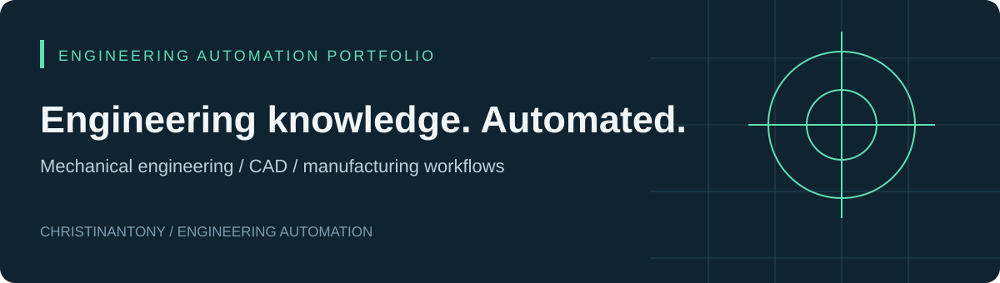
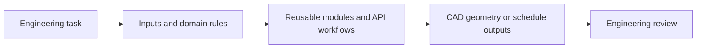

# Mechanical engineer building engineering automation

I turn repetitive engineering work into reusable tools. My work connects mechanical design, manufacturing workflows, and software: from automating CAD operations with the SolidWorks API to generating dependency-based engineering project schedules in MATLAB.

I care about the architecture behind an automation: how inputs are validated, engineering rules are represented, units are handled, dependencies are preserved, and outputs become useful to an engineer.

## Featured projects

| Project | Engineering problem | Implementation |
| :--- | :--- | :--- |
| **[SolidWorks Engineering Automation](https://github.com/Christinantony/solidworks-engineering-automation)** | Repetitive component numbering, coordinate entry, feature creation, and drawing annotation | VBA, SolidWorks API, Excel COM; readable source recovered from 16 macro projects |
| **[VerdantPERT](https://github.com/Christinantony/verdant-pert)** | Rebuilding manufacturing and antenna-development schedules by hand | MATLAB application, engineering rule databases, workflow generators, dependency graphs, critical-path and float analysis |

## How I approach automation

**Domain knowledge → data model → automation → engineering output.**

- **CAD workflows:** assembly traversal, document-reference handling, Hole Wizard experiments, sketch points, and annotations.
- **Cross-platform workflows:** Excel coordinate input connected to SolidWorks geometry through VBA and COM.
- **Manufacturing planning:** prototype, machining, PCB, procurement, enclosure, composite, and integration streams expressed as task dependencies.
- **Software structure:** event handlers, modular import pipelines, configurable engineering databases, graph algorithms, and MATLAB UI callbacks.

## Explore the work

Start with each project's README for the problem, architecture, source links, usage, examples, and current limitations. The repositories distinguish implemented code from experiments and unfinished interfaces. Runtime validation is documented separately from source inspection.

The featured repositories contain my supplied engineering projects. Forked repositories elsewhere on this account reflect tools I explore and are credited to their upstream authors.
