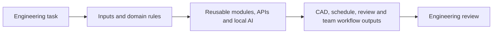

# Mechanical engineer building engineering automation

I turn repetitive engineering work into reusable tools. My work connects mechanical design, manufacturing workflows and software: automating CAD operations with the SolidWorks API, generating dependency-based project schedules in MATLAB, checking drawings with a locally run AI model, and designing software for engineering-team coordination.

I care about the architecture behind an automation: how inputs are validated, engineering rules are represented, units are handled, dependencies are preserved, and outputs become useful to an engineer.

## Featured projects

| Project | Engineering problem | Implementation |
| :--- | :--- | :--- |
| **[Drawing Verification AI](https://github.com/Christinantony/drawing-verification-ai)** · new | Slow, error-prone first-pass review of drawings, BOMs and inspection checklists | Python, Gemma 4 E4B run offline through Ollama, PyMuPDF, pdfplumber, OpenCV, Tesseract; three tools with a pytest suite |
| **[SolidWorks Engineering Automation](https://github.com/Christinantony/solidworks-engineering-automation)** | Repetitive component numbering, coordinate entry, feature creation and drawing annotation | VBA, SolidWorks API, Excel COM; readable source recovered from 16 macro projects |
| **[VerdantPERT](https://github.com/Christinantony/verdant-pert)** | Rebuilding manufacturing and antenna-development schedules by hand | MATLAB application, engineering rule databases, workflow generators, dependency graphs, critical-path and float analysis |
| **[Engineering Board](https://github.com/Christinantony/engineering-board)** · private | Coordinating mechanical-design jobs, workload, drawing reviews and team handovers | Architecture designed by me; React, TypeScript, Node.js, SQLite, REST API and live updates |

### Drawing Verification AI: local AI for drawing review

An offline toolkit that gives a drawing reviewer a list of suspected problems before they start. One tool audits a single drawing for typos, title-block contradictions and title block vs BOM mismatches. A second reads tolerances off the drawing's zone grid and fills the inspection checklist. A third cross-checks a whole set of drawings, Word and Excel files for conflicting revisions, missing BOM drawings and broken `NEXT ASSY.` links.

The key design choice: **the model reads text, not pictures.** Deterministic code extracts the title block cell by cell from the CAD file's own rectangles (OCR only for scans, after orientation correction), and Gemma 4 E4B reasons over that clean text. Nothing leaves the engineer's machine. The repository separates working tools from the one module still to be added, and documents what the tests do and do not cover.

### Engineering Board: my architecture work

I designed the architecture for an engineering-team workboard built around mechanical-design workflows. The system brings together job tracking, workload views, drawing review and traceable team activity. Its architecture uses a single host on the local network, a React interface, a Node.js API, SQLite storage and live updates, with version-checked edits, atomic claiming and retry-safe creation.

**My contribution:** system architecture and engineering workflow design. **Access:** the repository is private; its source and internal documentation are available to authorized collaborators.

## How I approach automation

**Domain knowledge → data model → automation → engineering output → human sign-off.**

- **CAD workflows:** assembly traversal, document-reference handling, Hole Wizard experiments, sketch points and annotations.
- **Drawing quality control:** title-block and BOM extraction, zone-grid tolerance lookup, cross-drawing consistency rules, and severity-ranked findings for a reviewer.
- **Local AI integration:** offline Gemma models through Ollama, structured-text inputs instead of images, JSON outputs with safe fallbacks, and rules rather than the model making pass/fail decisions.
- **Cross-platform workflows:** Excel coordinate input connected to SolidWorks geometry through VBA and COM; PDF drawings to Word inspection checklists.
- **Manufacturing planning:** prototype, machining, PCB, procurement, enclosure, composite and integration streams expressed as task dependencies.
- **Engineering-team systems:** job lifecycles, drawing-review handovers, audit history, concurrency handling and local-network deployment architecture.
- **Software structure:** event handlers, modular import pipelines, configurable engineering databases, graph algorithms, MATLAB UI callbacks and tested Python pipelines.

## Tools I work with

| Area | Tools |
| :--- | :--- |
| CAD and engineering | SolidWorks, SolidWorks API, engineering drawings and BOMs, ISO zone grids and general tolerances |
| Languages | Python, VBA, MATLAB, TypeScript |
| Documents and data | PyMuPDF, pdfplumber, Tesseract OCR, OpenCV, python-docx, openpyxl, Excel COM |
| AI | Gemma 4 E4B and Gemma 3 through Ollama, run fully offline |
| Applications | React, Node.js, SQLite, REST APIs |

## Explore the work

Start with each project's README for the problem, architecture, source links, usage, examples and current limitations. The repositories distinguish implemented code from experiments and unfinished parts, and runtime validation is documented separately from source inspection. A capability-by-capability evidence map is in [docs/portfolio-map.md](docs/portfolio-map.md).

The featured repositories contain my supplied engineering projects. Forked repositories elsewhere on this account reflect tools I explore and are credited to their upstream authors.
